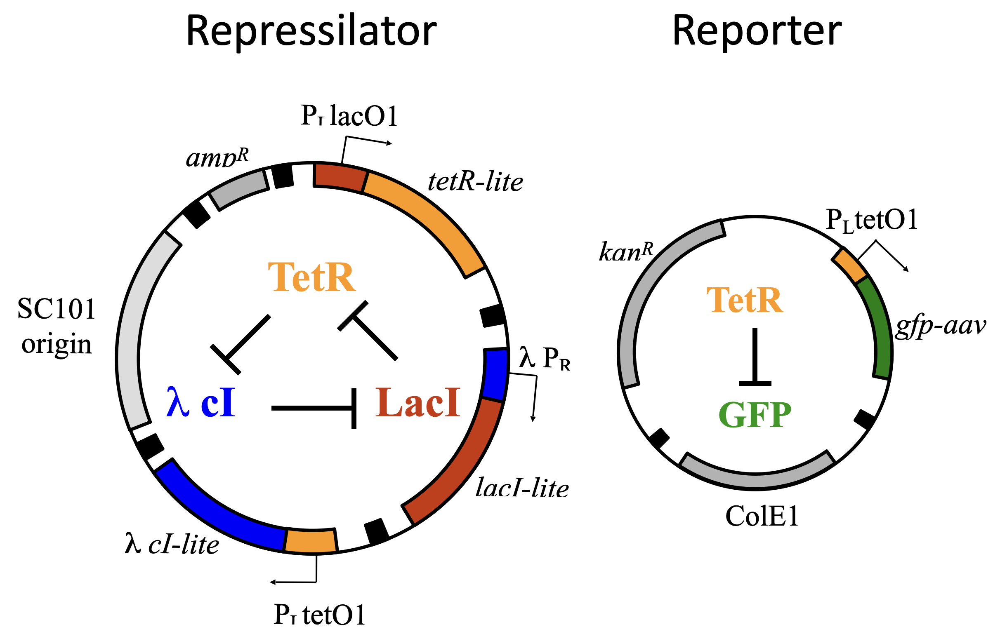
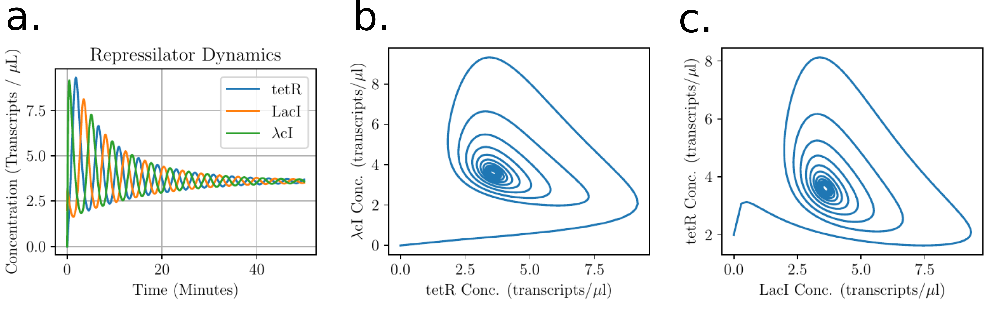

# Simulation of repressilator
Simulation of repressilator from Liebler and Elowitz, Nature, 2000 (https://doi.org/10.1038/35002125)

## Minimal model of repressilator

<p align="center">  </p>

It can be modelled by three coupled ODEs:

$$
\begin{align}
\frac{d}{dt}tetR = \frac{\alpha_0}{1 + lacI^n} - tetR \\
\frac{d}{dt}LacI = \frac{\alpha_0}{1 + \lambda cI^n} - LacI \\
\frac{d}{dt}\lambda cI = \frac{\alpha_0}{1 + tetR^n} - \lambda cI
\end{align}
$$

The equations can be solved analytically or numerically. A ```python``` script was written to solve and plot the dynamics of the repressilator, they show oscilatlion and limit cycle.

<p align="center">  </p>
