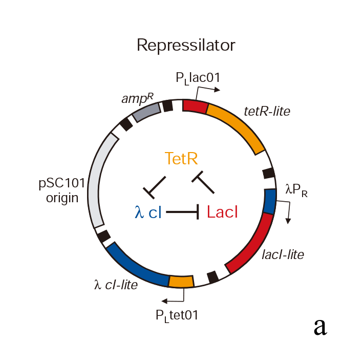
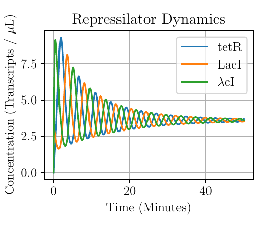
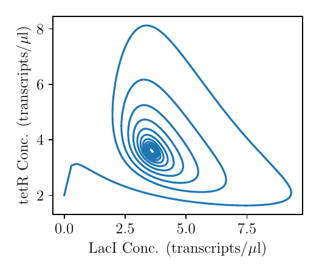
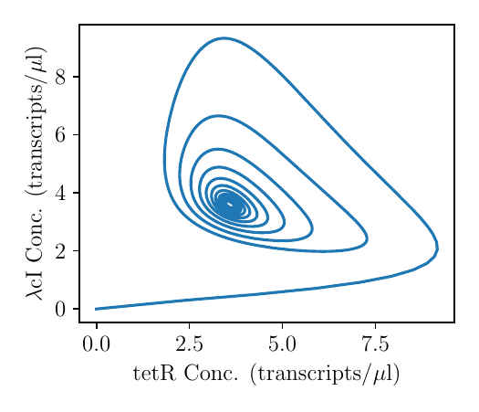

# Simulation of repressilator
Simulation of repressilator from Liebler and Elowitz, Nature, 2000 (https://doi.org/10.1038/35002125)

## Minimal model of repressilator

It can be modelled by three coupled differential equations:

$$
\begin{align}
\frac{d}{dt}tetR = \frac{\alpha_0}{1 + lacI^n} - tetR \\
\frac{d}{dt}LacI = \frac{\alpha_0}{1 + \lambda cI^n} - LacI \\
\frac{d}{dt}\lambda cI = \frac{\alpha_0}{1 + tetR^n} - \lambda cI
\end{align}
$$

